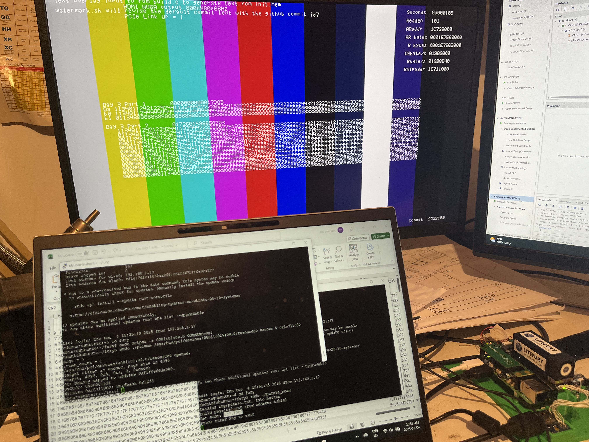
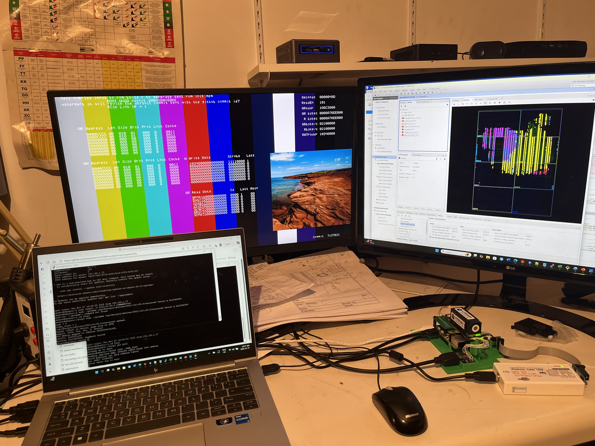
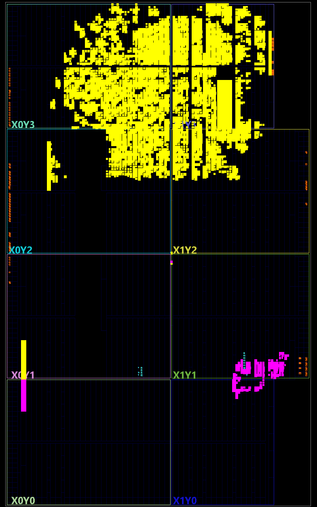
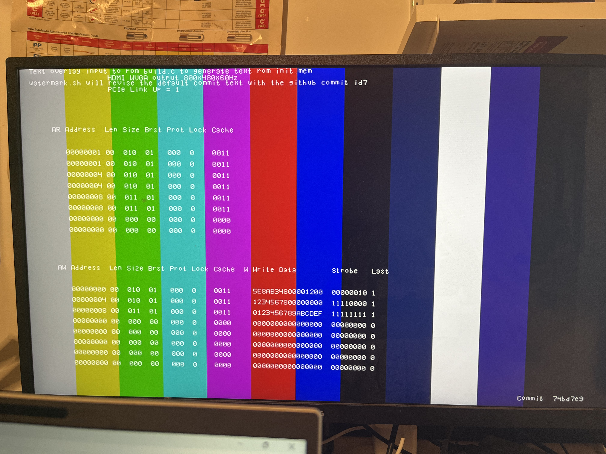
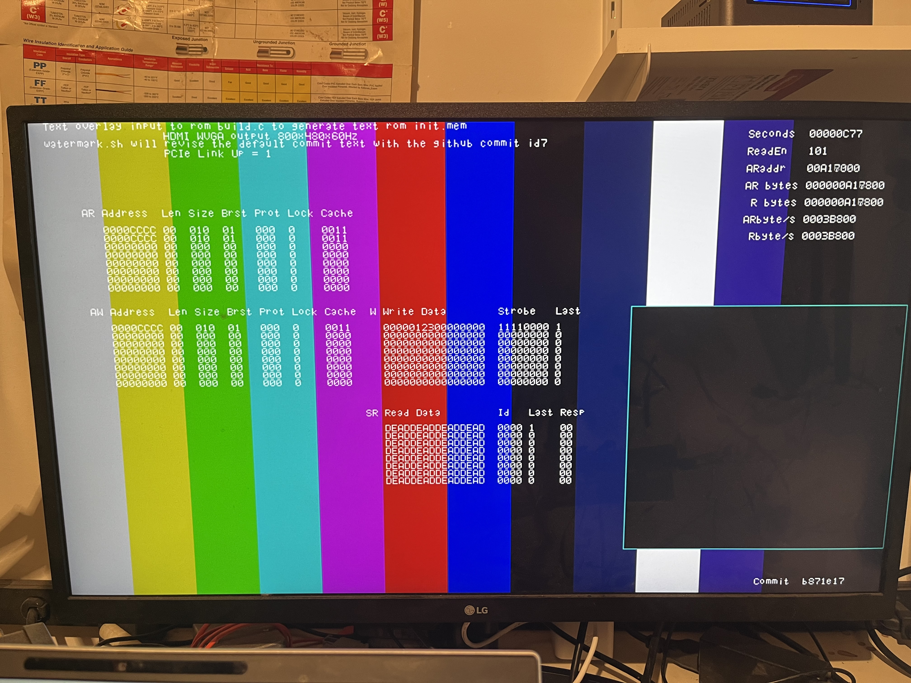
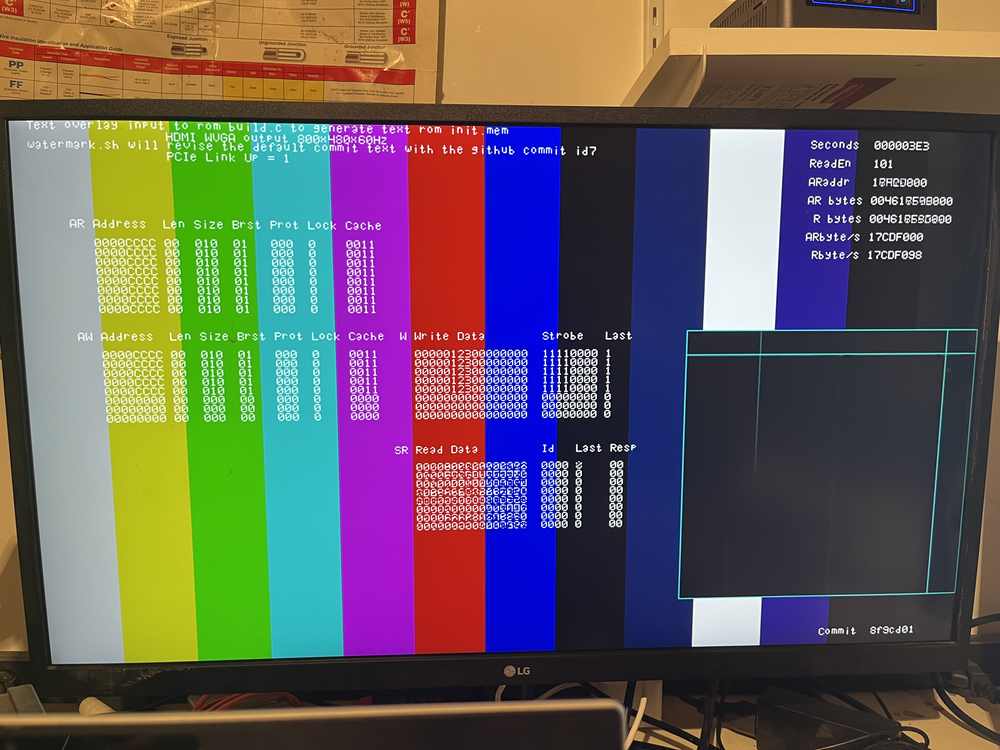

# Advent of Code 2025
Day 3 Puzzle solver logic implemented in an FPGA

In hardware this puzzle can be run at wire speed. So I chose to burst the puzzle data over PCIe
and have the harware accumulate the puzzle sums without stalling. I also used output pins of the device
to drive HDMI output and report the puzzle sums, recalculated every frame and show a visual display of the algorithm
operation (for the last row).

I started with the LiteFury M.2 Pcie fpga with a 100K gate Artix-7 FPGA.
I have it connected to a raspberry Pi5 running ubuntu, and had working
mastery of the PCIe bus with the fpga reading data from host C buffers.
I modified the design for the Day 3 puzzle, by loading the puzzle data (effectiveliy a 100x200 array)
with C code reading the puzzle.txt and holding it in memory (stack) and reporting a base address.
Every vsync the FPGA reads the puzzle data from the Pi5 memory over pcie (1x5gbit) and accumualtes 
and displays the sums for both part 1 and part 2 solutions.

To reproduce:

    Generate a bitstream the FPGA projecdt using Vivado 2025.1 (flatfury.xpr)
    Create and program the FPGA flash
    compile and run the puzzle_read.c to load the puzzle into memory, and get base address (0x1c711000 in example)
    power-cycle the system and the fpga pcie link up = 1 indicates connection on the display
    Enable the FPGA as a pcie device (write 6 into the pcie COMMAND register)
    Write the base address of the puzzle data into a register on the pcie device.
    FPGA will read the rat and 200 rows of data every vsync (66Hz)
    Both part 1 and part 2 sums will be reported, and the last row solution calculation will be logged and displayed

Here is a photo of the running system (2222c89). You can see the Pi5+Fury stack and the hdmi display showing the puzzle sums
and last row processing. It also shows a date rate consistant with 201 bursts of 2Kb each frame at 66Hz.

    

Here's the Day3 data as a 2D image

    

The Readme from the branch point of this project is below

# FlatFury

My xilinx Artix-7 fpga dev system for PCIe devlopment. It uses a LiteFury mounted to a raspberry Pi5 with M.2 slot.
I've incorporated my standard HDMI video output. It makes a compact little pcie development platform in which 
I've brought up the pcie interface without drivers directly accessing via: lspci, setpci, pcimem commands.

This repo builds upon the LiteFury basis but with a greatly simplified flat file hierarchy.
Its all system verilog and integrates a PCIe core and PLL ip modules (ungenerated) along with
the core HDMI graphics and text output.

Looking at the Floorplan we can observe (yellow) the minimal AXI-PCIe 1x 5g core reported 15% LE utilization. 
The HDMI core (magneta) is quite tiny for its usefulness!

Now is time to bring up the pcie hardware. It proved helpful to add logic to capture the last eight (8) PCIe AXI transactions,
on each of the AXI-AR, AXI-AW, AXI-W busses to be able to prove exact operation. The busses were wired with simple handshake
with all addr/data/ctl feilds ignored. Added logic to display the 3x8 axi bus capture buffers on HDMI. 

In a shell on the raspberry Pi, running the following command sequence allowed me to enabled the device BAR for access, 
and then do { double-word, word, byte } accesses of R-W-R transfers to the hardware for logging.
using the pcimem command (from https://github.com/billfarrow/pcimem) to do the actual to the device without a device driver.

    lspci
    lspci -n
    lspci -d 10ee:7021 -nvv
    sudo setpci -s 0001:01:00.0 COMMAND=0x2
    lspci -d 10ee:7021 -nvv
    sudo ./pcimem /sys/bus/pci/devices/0001\:01\:00.0/resource0 0x8 d 0x0123456789abcdef
    sudo ./pcimem /sys/bus/pci/devices/0001\:01\:00.0/resource0 0x4 w 0x12345678
    sudo ./pcimem /sys/bus/pci/devices/0001\:01\:00.0/resource0 0x1 b 0x12

After running the commands the HDMI display shows the 6 RA read address transactions and the 3 AW write address transactions
and the 3 associated W write data trasfers. All looks good (and note the watermark).

Using the following commands to enable the fpga pcie endpoint and start a DMA read of memory.

    sudo setpci -s 0001:01:00.0 COMMAND=0x6
    sudo ./pcimem /sys/bus/pci/devices/0001\:01\:00.0/resource0 0xcccc d 0x123

THe picture shows the performance meters working (DMA is throttle currently to ~0.25 mbyte/sec).
However there is still some work to go as the read data itself is DEADDEAD... The issue is the AXI to PCIE 
address mapping I suspect. (I wish the IP supported a 64 bit AXI address). The 256 x 256 window is to show a
memory map with each pel representing 64Kbytes. This way I can show read progress of the full 4G Pi5 dram and mark
*interesting* addresses.

Adding logic to set the 64 bit PCIe base address enabled read access to the full host memory. Upping the speed we measure 17cdf000 = 400 Mbytes/sec.
At this rate it takes 10 seconds to read the full 4Gbytes of pi5 host memory. Nice for a single 5Gbit pcie lane.

Now that we have direct access to the host PI's dram a simple demo can be developed to display images stored in the host memory.
A small piece of code (bmp_read.c) isused to load a 24-bit rgb .bmp file into memory, and provide a single physical address to the console, and then wait i
(holding the image in memory, hopefully not be swapped out, need to look for meachanism to ensure its not).

    $ cc bmp_read.c -o bmp_read
    $ sudo ./bmp_read
    Reading img/test.bmp, 256x256 rgb24 image into memory
    Build physical rat (row address table)
    Rat addr: 10348000
    Press enter key to exit

The above C code reads the image into stack buffer and reports a physical address, and then pauses for a keystroke input.
On a second console we can enable the FPGA pcie access, and write the provided physical address into it.

    $ sudo setpci -s 0001:01:00.0 COMMAND=0x6
    $ sudo ./pcimem /sys/bus/pci/devices/0001\:01\:00.0/resource0 0xcccc w 0x10348000

The FPGA then initiates a continuous read dma, of during VSYNC reading a RAT table from the provided address via PCIe,
and then prefetching display data before needed for each row of the window during HDMI display rendering.

