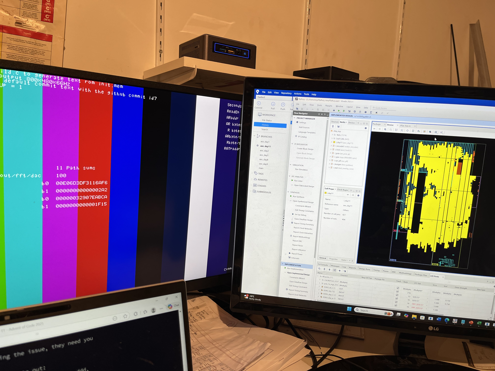
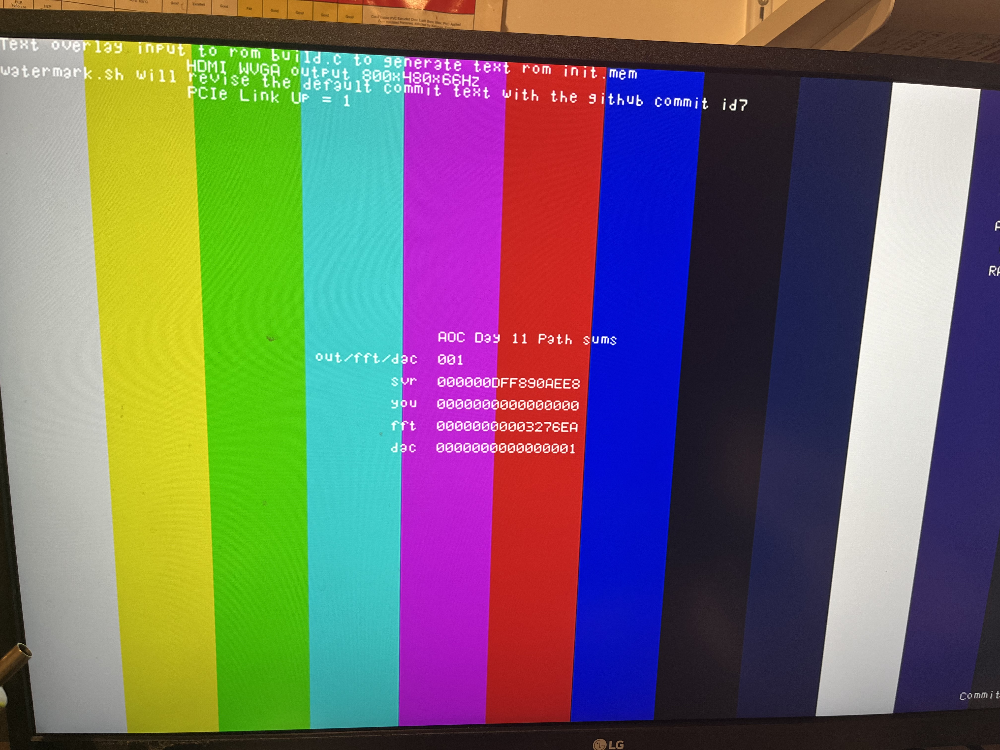
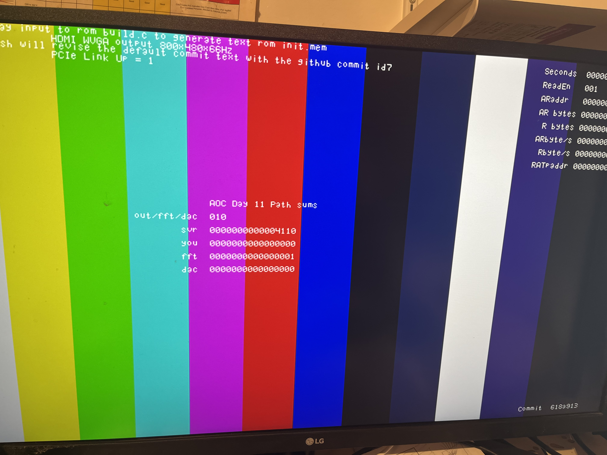
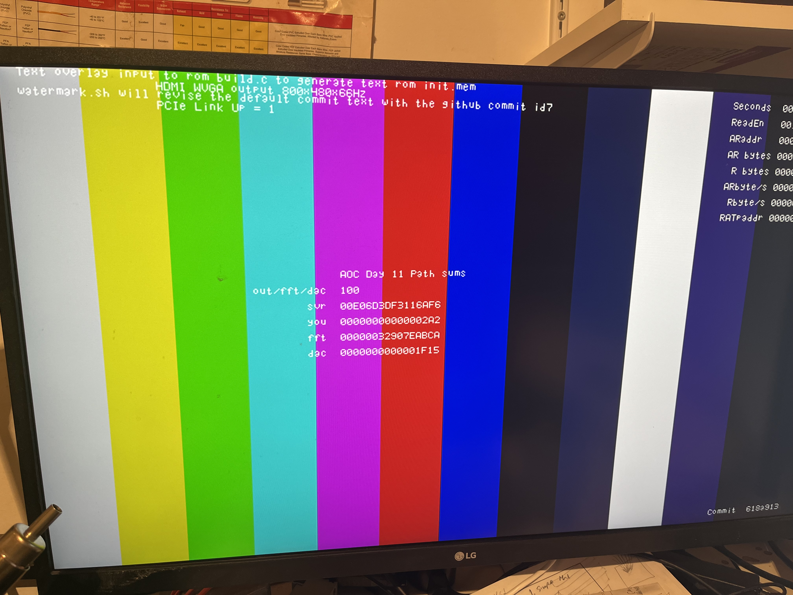

# Advent of Code 2025 Day 11 Parts 1 & 2

Xilinx Artix-7 fpga solves DAY 11 Part 2 in 1.1uS (3 clock cycles of 369.7nS).

This puzzle solution realliy takes advantage of FPGA parallel logic.

Each puzzle text line was converted to a verilog statement. Thus the puzzle was implemented in combinatorial hardware
and executed fully parallel. The graph in this case was implemented in 64 bit math ,
The time for the logic to settle when inputs change was timed out as 369.7nS. The puzzle logic took 33616 LEs (lut5).

Here's a photo where you can see the floorplan with the puzzle logic highlighted.

    

To use this fpga to solve part1 and part 2, the following commands were executed on the host Pi5 (unbuntu). First PCIe was enabled for host accesses and
then the inputs were sequenced thru setting inputs DAC, then FFT, then OUT.

    sudo setpci -s 0001:01:00.0 COMMAND=0x2
    sudo ./pcimem /sys/bus/pci/devices/0001\:01\:00.0/resource0 0xcc0c w 0x1
    sudo ./pcimem /sys/bus/pci/devices/0001\:01\:00.0/resource0 0xcc0c w 0x2
    sudo ./pcimem /sys/bus/pci/devices/0001\:01\:00.0/resource0 0xcc0c w 0x4

The display was observed. From the first picture we see paths DAC->FFT are 0x3276EA 
    

From the 2nd display we see paths FFT->SVR are 0x4110
   

and finallty from the 3rd display we see paths OUT->DAC are 0x1F1f and OUT->YOU are 0x2a2.
    

The puzzle solution to part 1 is OUT->YOU, while for part 2 it is OUT->DAC * DAC->FFT * FFT->SVR

(after finding the correct solution I see that 22-bit math would be fine).

